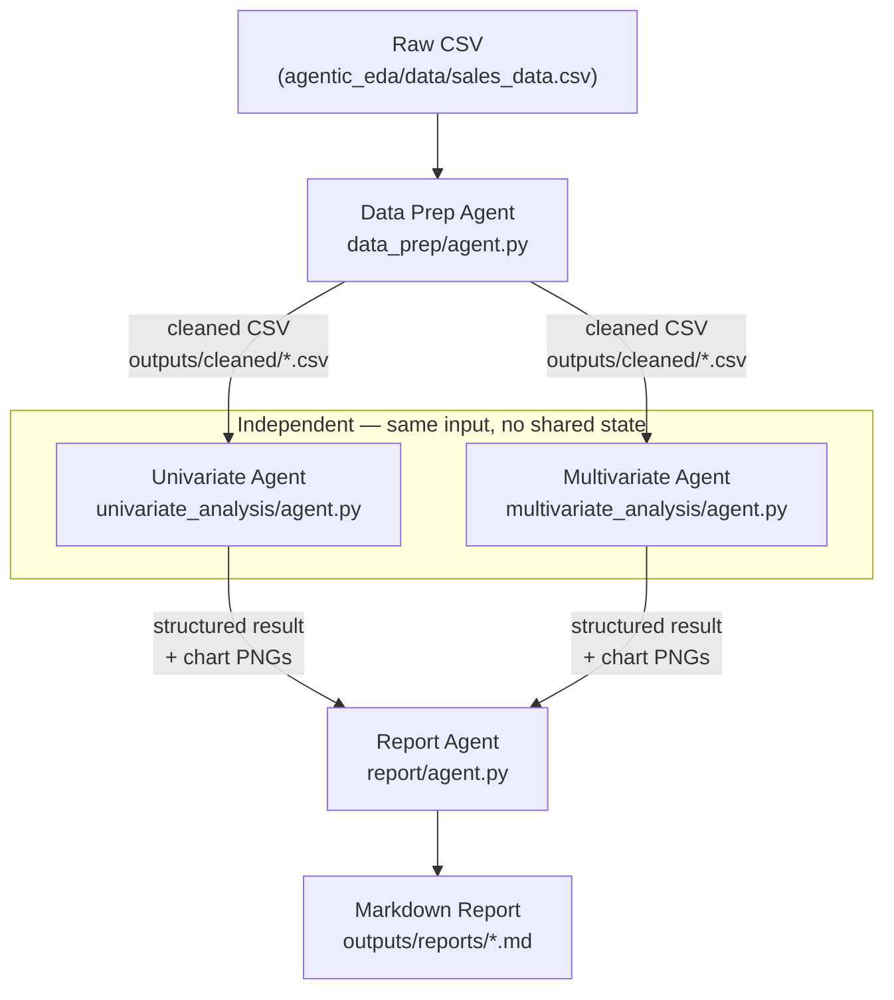
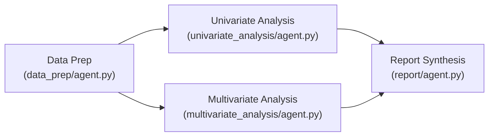

# EDA Agent Pipeline — Execution Architecture

## Diagram

## What each step does

| Step | Module | Input | LLM call | Subprocess execution | Output |
|---|---|---|---|---|---|
| **1. Data Prep** | `data_prep/agent.py` | Raw CSV profile | Reasons about nulls/types/dates, generates pandas cleaning code | Runs the generated code in isolation | Cleaned CSV |
| **2a. Univariate** | `univariate_analysis/agent.py` | Cleaned CSV profile | **Multi-turn:** Turn 1 plans charts per variable; Turn 2 generates matplotlib code | Runs the code in a headless (`Agg`) subprocess with bounded self-correction loops | One PNG per selected variable → `outputs/charts/univariate/` |
| **2b. Multivariate** | `multivariate_analysis/agent.py` | Cleaned CSV profile + correlation report | **Multi-turn:** Turn 1 selects relationships clearing the correlation threshold; Turn 2 generates matplotlib code | Runs the code in a headless subprocess with bounded self-correction loops | One PNG per selected relationship + correlation heatmap → `outputs/charts/multivariate/` |
| **3. Report** | `report/agent.py` | Structured results + chart images from steps 1, 2a, 2b | **Single multimodal call:** reasons over the stage reports and visual charts to synthesize narrative findings | — (no code generated) | Markdown report assembled deterministically → `outputs/reports/` |

### Key Architectural Concepts

#### Configurable Models per Agent
Instead of enforcing a single, uniform model across all agents, each agent defines its own local client configuration and target model (`OPENAI_MODEL` in its respective `agent.py`). This offers several design benefits:
- **Cost & Speed Optimization**: Simpler task stages (like Data Prep or Univariate charting) can run on faster, cheaper models (like `gpt-4o-mini`).
- **Targeted Capabilities**: The final report step can be targeted at a highly capable multimodal model (like `gpt-4o`) to visually interpret the charts, while other steps focus purely on text and code generation.
- **Granular Tuning**: Model choices can be experimented with or swapped out for individual agents without risking or modifying the stability of other pipeline stages.

#### Purpose of each stage
- **Data Prep**: Standardizes the schema (forces `Year/Month/Day/Hour` columns, correct dtypes) so downstream agents don't waste context or code handling validation and type parsing.
- **Univariate**: Focuses on individual columns. It uses a **multi-turn conversation** to separate the planning stage (chart type selection, grounding in profile) from code generation, making the pipeline's plan inspectable before code runs.
- **Multivariate**: Investigates pairwise column relations (e.g. numeric↔numeric and numeric↔categorical). A correlation matrix is precalculated deterministically in Python to guide the selection turn, preventing the LLM from plotting uninformative relationships.
- **Multi-turn Reasoning Continuity**: For the analysis agents, turns are sent with `store=True` and chained using `previous_response_id` so OpenAI handles conversation context server-side. If a generated script fails, `stderr` is fed back as a correction turn.
- **Per-item Isolation**: Generated code wraps each chart's rendering in its own `try/except` block, ensuring that one faulty column or category relationship does not break the entire pipeline execution.
- **Report Synthesis**: The report agent acts as a multimodal join-point. It reads the final charts visually and returns structured narrative findings. Python then assembles the markdown document layout deterministically, ensuring robust link and file output paths.

## Parallel Execution Potential

Although the pipeline runs sequentially today, it is structurally designed for parallel execution. The Data Prep stage acts as a bottleneck, but once the cleaned dataset is written, the Univariate and Multivariate analysis stages are completely independent of each other:

### Execution Details
- **Current Sequential Pipeline**: In `pipeline.py`, the stages run sequentially (`Data Prep` -> `Univariate` -> `Multivariate` -> `Report`). This makes logs straightforward to follow and simplifies tracing OpenAI API response states and stdout/stderr output.
- **Parallelization Capabilities**: Because both Univariate and Multivariate analysis are I/O-bound (each calls its own target OpenAI model and executes generated python code in a child subprocess) and share no state, they are fully concurrently runnable. The pipeline can be parallelized (e.g., utilizing `asyncio.gather` or a thread pool in `pipeline.py`) to reduce the total processing time by letting both analysis stages execute simultaneously.
- **Report Synthesis Join-Point**: The Report stage serves as a synchronization join-point. It cannot begin execution until both Univariate and Multivariate analysis have completed and generated their respective charts and structured analysis outputs.
