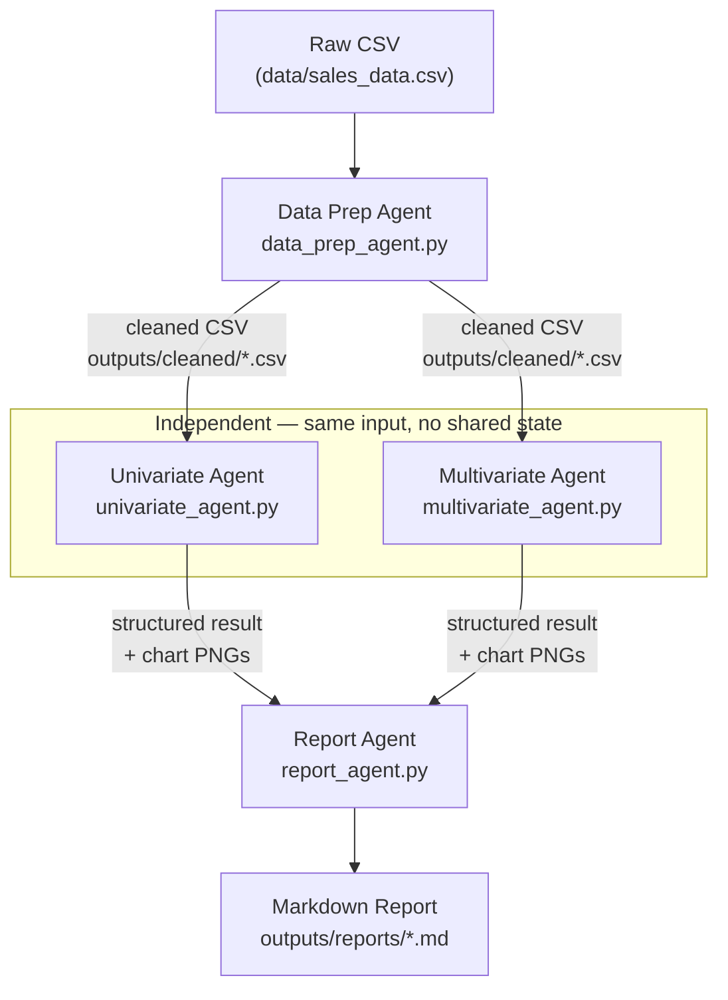

# EDA Agent Pipeline — Execution Architecture

## Diagram



## What each step does

| Step | Module | Input | LLM call | Subprocess execution | Output |
|---|---|---|---|---|---|
| **1. Data Prep** | `data_prep_agent.py` | Raw CSV profile | Reasons about nulls/types/dates, generates pandas cleaning code | Runs the generated code, appends `df.to_csv(...)` | Cleaned CSV |
| **2a. Univariate** | `univariate_agent.py` | Cleaned CSV profile | **Multi-turn:** Turn 1 classifies each column and selects a chart per variable (histogram/bar/top-N) or skips it; Turn 2 generates matplotlib code for exactly those (reasoning carried across turns via `previous_response_id`) | Runs the code in a headless (`Agg`) subprocess; **self-corrects from errors** — bounded retries feed `stderr` back as a `diagnose_fix` turn on the same response chain | One PNG per selected variable → `outputs/charts/univariate/` |
| **2b. Multivariate** | `multivariate_agent.py` | Cleaned CSV profile **+ precomputed correlation report** | **Multi-turn:** Turn 1 selects relationships that clear the correlation threshold (numeric-numeric, numeric-categorical) + heatmap; Turn 2 generates matplotlib code for exactly those (reasoning carried across turns via `previous_response_id`) | Runs the code in a headless subprocess; **self-corrects from errors** — bounded retries feed `stderr` back as a `diagnose_fix` turn on the same response chain | One PNG per selected relationship + heatmap → `outputs/charts/multivariate/` |
| **3. Report** | `report_agent.py` | Structured results + chart **images** from steps 1, 2a, 2b | **Single multimodal call:** serialized per-stage context (profile, correlation report, plans, reasoning, summaries) + the chart PNGs attached as images → a structured narrative (per-section prose + per-chart findings) | — (no code generated) | Markdown report assembled deterministically → `outputs/reports/` |

### Purpose of each stage

- **Data Prep** exists so every downstream agent works from a validated, normalized frame (mandatory `Year/Month/Day/Hour` columns, correct dtypes, no redundant columns) instead of each agent re-deriving that logic.
- **Univariate** answers "what does each variable look like on its own" — distribution shape, outliers, top categories. It is a **multi-turn conversation**: Turn 1 classifies every column and decides, per variable, which single-variable chart to render (or to skip it); Turn 2 — chained onto Turn 1 via `previous_response_id`, with `reasoning.context` moving from `current_turn` to `all_turns` — generates chart code for exactly those. Splitting *selection* from *code generation* keeps each turn's context focused and lets the plan be inspected independently of the code.
- **Multivariate** answers "how do variables relate to each other" — correlations and grouped comparisons. Because deciding *which* pairs are worth plotting requires seeing the real correlations, this stage is also **multi-turn**: a correlation matrix is computed deterministically in Python and injected, Turn 1 selects the relationships that clear a configurable threshold (`CORRELATION_THRESHOLD`, default `|r| ≥ 0.3`), and Turn 2 — chained onto Turn 1 via `previous_response_id` — generates chart code for only those. Deliberately scoped to numeric↔numeric and numeric↔categorical for now; categorical↔categorical and 3+-way interactions are logged as out-of-scope rather than guessed at.
- **Multi-turn reasoning continuity (both analysis agents, `store=True`)**: each turn is sent with `store=True` and the *next* turn passes the prior response's `id` as `previous_response_id`, so OpenAI retains the conversation (including reasoning) server-side — no manual history list or `include=["reasoning.encrypted_content"]` bookkeeping is needed. Each agent defines its own local `client`/`OPENAI_MODEL` (`data_prep_agent.py`, `univariate_agent.py`, `multivariate_agent.py` each construct their own `OpenAI(api_key=OPENAI_API_KEY)`), so they can be pointed at different models independently. On execution failure, the subprocess `stderr` is sent as a new input chained onto the failing code-gen response's `id` — a `diagnose_fix`-phase turn that must (1) pinpoint the exact line/API from the traceback, (2) state the root cause explicitly, (3) scan the *rest* of the script for the same class of mistake rather than patching only the failing line, and (4) add data-shape guards where relevant — bounded by `max_fix_attempts` before the error is raised to the caller.
- **Per-item error isolation**: the generated matplotlib scripts wrap each chart's render-and-save block in its own `try/except Exception` (one per variable for Univariate, one per relationship/heatmap for Multivariate) so a single bad column or pair can't abort the whole script; a skipped item is dropped from `expected_output_files` rather than silently over-promised.
- **Report** exists to synthesize the above into one artifact a human can read without opening the code or the raw PNGs individually. It is a **single-turn multimodal synthesis**: each stage's structured output is serialized to tagged text and the chart PNGs are attached as images, so the model *reads the charts visually* (distribution shape, correlation direction/strength, dominant categories) rather than narrating from filenames alone. It returns a structured `EdaReportResponse` (executive summary, per-stage narrative, one finding per chart keyed by filename, cross-stage insights, consolidated assumptions); Python then assembles the markdown deterministically — pairing each finding with its report-relative image link and embedding the generated code in an appendix — so the model never has to guess file paths or layout. Because it consumes images, its `OPENAI_MODEL` must support vision as well as Structured Outputs. No code is generated, so there is no subprocess or self-correction loop here.

All generated code runs in a **subprocess**, never `exec()`-ed in-process — the LLM's code is untrusted, so isolation + timeout + output-existence checks are the safety boundary (see `executors.py`).

## Where it parallelizes

**Univariate and Multivariate are independent of each other.** Both only read the cleaned CSV produced by Data Prep; neither reads the other's output. This is a classic **fan-out / fan-in** shape:

```
        ┌─ Univariate ─┐
Prep ───┤              ├─── Report
        └─ Multivariate ┘
```

- **Currently**: `pipeline.py` calls them **sequentially** (`run_univariate_analysis` then `run_multivariate_analysis`) — simplest to reason about and debug, but leaves speed on the table.
- **Parallelizable today, not yet implemented**: since each stage's work is I/O-bound (an OpenAI API call + a local subprocess run, not CPU-bound computation), running the two stages concurrently — e.g. via a thread pool or `asyncio.gather` — would let their LLM calls and subprocess executions overlap instead of queuing back-to-back.
- **Report stays a join point**: it can't start until both branches finish, since it aggregates both into one `EdaContext`.
- **Not parallel within a stage**: each agent still does one LLM call → one subprocess run, in that order; there's no batching or fan-out inside a single agent today.
